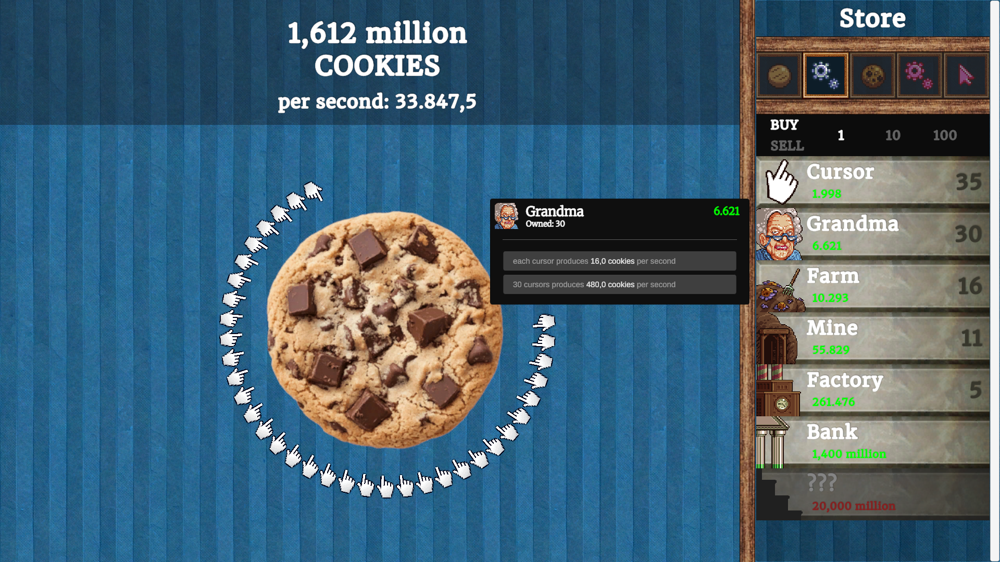
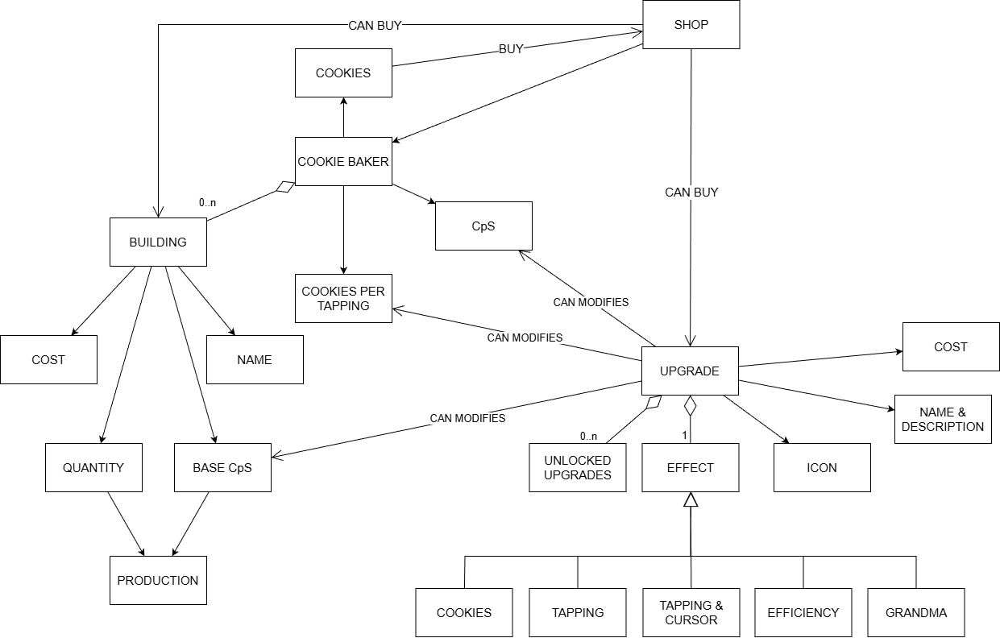

# COOKIE CLICKER CLONE

## TL;DR

`Unity version: 6000.0.60f1`

A small project built to practice **Clean Architecture**, **MVC** and **Test-Driven Development**.

This project recreates the core mechanics of *Cookie Clicker*:
- Cookie clicking
- Purchasing buildings and upgrades from a shop
- Automatic production over time

The focus of the project is not visual polish, but demonstrating good **software architecture**, **domain-driven structuring** and **unit-tested gameplay logic**.

You can play the game directly in your browser or download the Windows executable from the [`itch.io`](https://diegorg64.itch.io/cookie-clicker-clone) page.

## Project Overview

This project was built as an exercise in software architecture, applying **Clean architecture** and **MVC** within Unity. All game logic is isolated in a pure domain layer, fully independent from Unity, and was developed using **TDD** to keep the system simple, testable, and maintainable.

I chose *Cookie Clicker* as a reference because is a perfect case study for domain modelling: its mechanics (incremental production, exponential progression, passive income, dynamic pricing) are entirely deterministic and engine-agnostic, making it an ideal sandbox por practicing clean separation between domain and presentation.

### Features

A quick overview of the main mechanics implemented in this project:
- **Cookie Clicking**: generate cookies by clicking the main cookie.
- **Passive Production System**: buildings produce cookies per second, updated every frame.
- **Buildings Shop**: purchase buildings with dynamic pricing and a progression system that reveals new buildings as you play.
- **Upgrade Shop**: buy upgrades thant enhance cookie production globally or for specific building types.
- **Upgrade Unlock Conditions**: each upgrade has its own requirement and becomes visible only when those conditions are met.
- **Clean Architecture Structure**: all gameplay logic lives entirely in the domain layer, fully isolated from Unity.
- **TDD Workflow**: core systems are developed with automated tests.

## Architecture

The project follows a *modular Clean Architecture* approach.

Instead of using a single monolithic Domain layer, the game is divided into feature-oriented modules:
- **Cookies**: core cookie generation, buildings, production
- **Store**: purchasing buildings, visibility progression, shop logic
- **Modifiers**: upgrades and production multipliers

Each module is internally split into two layers:
- **Domain**: pure C# logic, entities, value objects, services and rules. No Unity dependencies and fully covered by TDD.
- **Infrastructure**: Unity-specific implementation: Monobehaviours, ScriptableObjects, UI bridges...

All modules are enforced using **Unity assemblies**, preventing cyclic dependencies and keeping the domain isolated from Unity at all times.

This modular architecture makes the project:
- Fully testable (all gameplay logic lives in Domain)
- Easy to extend (each feature evolves in its own module)
- Independent from Unity, allowing the UI or engine layer to be swapped without touching the core logic

*Domain Model*

## MVC Breakdown

For both the Buildings Shop, the Upgrades Shop, and the main Cookie View I implemented a clean MVC structure inside the *Infrastructure/UI* layer.

### Model

Domain objects representing buildings, upgrades, costs, production and progression. These objects live entirely in the Domain assemblies and contain all game logic.

### Controller

Controllers act as the bridge between Unity UI and the domain:
- listen to UI events
- call domain services and entities
- format the results into DTOs
- update the view

Controllers depend only on:
- domain types
- UI interfaces (not Unity components!)

### View

Pure Unity UI components (MonoBehaviours).
Views are intentionally passive:
- they display data
- the expose input events (button clicks, hover events, mode changes)
- and implements interfaces such as **IBuildingStoreView** or **IUpgradeStoreView**

Because controllers refer only to these interfaces, the UI is fully decoupled from the domain logic.

This design follows the **Dependency Inversion Principle (DIP)**:
- controllers depend on abstractions (view interfaces)
- Unity UI lives in the infrastructure layer and merely implements those interfaces.

This allow the entire UI to be redesigned, replaced, or tested in isolation without modifying domain logic or controllers.

*Buildings Store - MVC Diagram*

## TDD & Testing

I applied TDD mainly to the domain layer, where all game logic is implemented independently of Unity. Each module (Store, Modifiers, Cookies) is fully covered by unit tests validating their rules and behaviours.

Tests cover the core mechanics: cost progression, CPS calculations, upgrade effects, unlocking conditions, etc. The workflow was always the same: write the failing test, implement the minimum logic, then refactor safely.

Using TDD helped keep the domain pure and free of Unity dependencies, and made it easier to evolve the architecture confidently while maintaining clean module boundaries.

## Learnings & Challenges

Working on this project taught me a lot about applying Clean Architecture inside Unity. Keeping the domain completely isolated from Unity code made the game logic far easier to test and reason about.

A major challenge was applying MVC cleanly. Maintaining a strict separation between Model, View, and Controller was not always intuitive in Unity’s component-driven environment. Updating the UI without letting the View depend on domain objects required using DTOs to bridge the gap. In hindsight, for a game with constantly changing values (cookies, production, prices), introducing an observer-style pattern to notify controllers about state changes might have produced a cleaner flow.

Overall, this project reminded me of the balance between architectural discipline and over-engineering: patterns are powerful tools, but they must earn their place.

## Next Steps

If I continue expanding the project, my main focus would be building an editor tool to manage buildings and upgrades. Currently, designers need to manually create and configure several ScriptableObjects. A dedicated editor window that centralises building data, upgrade definitions, and their relationships would streamline iteration and make the system much more designer-friendly.

## Documentation

All design and architecture diagrams (domain model, MVC breakdown, module interactions…) are stored in the `Docs~` folder.